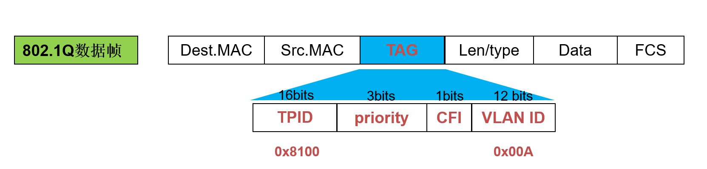

# vlan 简介

# 总览
是什么？
解决什么问题？
原理？
优劣势？
代码实现？
应用？

# 是什么
全称是 Virtual Local Area Network， 顾名思义是虚拟的局域网。
一个局域网是一个广播域, 通过划分vlan的方式，可以将广播域分隔成多个广播域。

# 解决什么问题？

# 原理？

# 参考链接

https://www.ietf.org/rfc/rfc2674.txt

# 名词解释
广播域: 
